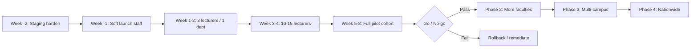

# Lectrax Production Pilot Strategy

**Audience:** Solutions architecture, programme management, university IT, Lectrax operations  
**Scope:** First university production pilot → controlled multi-campus → nationwide expansion  
**Stack context:** Next.js (Vercel) main + admin apps, Supabase (Auth/Postgres/RLS/Storage), Monime payments, Upstash rate limits, Sentry observability, PWA (online-required for QR/grades/submit)

---

## Executive recommendation (pilot sizing)

| Parameter | Pilot recommendation | Rationale |
|-----------|----------------------|-----------|
| **Departments / faculties** | **1** (single school/faculty) | Contain blast radius; one academic champion |
| **Lecturers** | **10–15** active | Enough concurrency for QR/grades without saturating support |
| **Students** | **400–700** enrolled | Realistic classroom load; fits one faculty cohort |
| **Maximum class size** | **80–100** students | QR scan stampede stays within validated attendance design; larger halls phase 2 |
| **Concurrent live attendance sessions** | **≤ 5** at the same minute | Limits DB session-row + scan contention |
| **Pilot duration** | **8 weeks** (2 prep + 6 live teaching) | Covers onboarding, mid-term usage, one assessment cycle |
| **Commercial model during pilot** | **University-sponsored / grant-free lecturers** preferred | Removes payment friction from academic success metrics |
| **Environments** | Dedicated **production** project + retained **staging** | Never pilot on shared staging data |

**Do not** start with full-university enrollment, multi-faculty go-live, or nationwide marketing in week 1.

---

## Low-risk rollout strategy (overview)

**Principles**
1. **One faculty first** — academic process risk dominates technical risk.
2. **Feature gates** — enable QR attendance + class join first; assignments/grades week 2+; payments only if required.
3. **Manual override always available** — lecturer manual attendance and grade entry are the safety net.
4. **Observable go/no-go** — every expansion gate uses metrics below, not anecdotes.
5. **Rollback is rehearsed** — dry-run rollback once on staging before pilot week 1.

---

## 1. Production Launch Checklist

### 1.1 Programme & contracts
- [ ] Pilot MoU signed (data processing, support hours, success criteria, exit/rollback)
- [ ] Named university sponsor + Lectrax incident owner + on-call rota for pilot hours
- [ ] Academic calendar mapped (timetables for live QR peaks)
- [ ] Acceptable use / privacy notice reviewed with university DPO/IT
- [ ] Support channel agreed (WhatsApp/email/IT helpdesk SLA)

### 1.2 Infrastructure
- [ ] Supabase **production** project created (not staging)
- [ ] All migrations applied through latest (`supabase/migrations`, including attendance harden `055`)
- [ ] Supabase **PITR / daily backups** enabled; retention ≥ 14 days (prefer 30)
- [ ] Connection pooling (Supavisor/transaction mode) configured for serverless
- [ ] Vercel **main app** production deploy (`NEXT_PUBLIC_APP_URL`)
- [ ] Vercel **admin app** production deploy (`deploy/lectrax-admin`, `NEXT_PUBLIC_DEPLOYMENT_TARGET=admin`)
- [ ] Custom domains + TLS valid (main + admin)
- [ ] Upstash Redis (`UPSTASH_REDIS_REST_URL` / `TOKEN`) live — required for multi-instance rate limits
- [ ] Sentry project linked (`SENTRY_DSN`, `NEXT_PUBLIC_SENTRY_DSN`); alert rules from `observability/sentry-alert-rules.json`
- [ ] Monime production (or pilot) credentials; webhook URL verified (`/api/webhooks/monime`)
- [ ] Cron secret set; Vercel cron hits `/api/cron/subscription-lifecycle` with `Authorization: Bearer`
- [ ] Optional: VirusTotal key + `SUBMISSION_ANTIVIRUS_REQUIRED=true` if PDF submit is in scope

### 1.3 Secrets & config
- [ ] `QR_TOKEN_SECRET` ≥ 32 chars, unique to production
- [ ] `CRON_SECRET` rotated and stored in Vercel + secrets vault
- [ ] Service role key never in client / never in admin public env
- [ ] `NEXT_PUBLIC_ADMIN_APP_URL` / `NEXT_PUBLIC_MAIN_APP_URL` cross-wired
- [ ] Env validated (`npm run validate:env` equivalent in CI/deploy)

### 1.4 Identity & access
- [ ] At least **2** `platform_admin` accounts (primary + backup)
- [ ] Pilot lecturers listed; free/grant subscriptions applied if payment deferred
- [ ] Test student + lecturer accounts for smoke only (labelled; not real grades)
- [ ] MFA / strong passwords policy communicated (Supabase Auth constraints)

### 1.5 Pre-production verification
- [ ] `/api/live`, `/api/ready`, `/api/health` green from production URL
- [ ] Login (phone + email paths used by campus)
- [ ] Lecturer: create class → start QR → refresh → end
- [ ] Student: join class → device register → scan → see present
- [ ] Manual attendance mark/unmark
- [ ] Assignment create → PDF submit → grade save (if in scope)
- [ ] Payment checkout dry-run or sandbox (if in scope)
- [ ] Admin: view students/lecturers, grant/extend subscription, audit log visible
- [ ] k6 smoke (`loadtests`) against staging at SCALE=100; QR burst at expected max class size
- [ ] Backup restore drill completed (see §4)

### 1.6 Campus readiness
- [ ] Wi‑Fi capacity checked in pilot lecture halls (QR requires live network)
- [ ] PWA install instructions for Android/iOS; offline = shell only (scan needs network)
- [ ] Lecturer devices have working cameras / display for QR
- [ ] Comms pack sent (onboarding checklists §7–9)

### 1.7 Go-live decision
- [ ] Launch checklist 100% for in-scope features
- [ ] On-call confirmed for first **5 teaching days**
- [ ] Rollback plan acknowledged by sponsor (§2)
- [ ] Written **GO** from Lectrax TPM + university sponsor

---

## 2. Rollback Plan

### 2.1 Rollback levels

| Level | When | Action | Data impact |
|------:|------|--------|-------------|
| **L0 – Feature disable** | Single feature failing | Stop using feature; keep app up; use manual processes | None |
| **L1 – Traffic freeze** | Elevated errors | Pause new signups; freeze lecturer invites; keep reads | None |
| **L2 – App rollback** | Bad deploy | Redeploy previous Vercel deployment (main + admin) | Code only |
| **L3 – Config rollback** | Bad secret/flag | Revert env vars; rotate compromised secrets | Sessions may invalidate |
| **L4 – Data repair** | Corrupt writes | Targeted SQL fix under change control | Surgical |
| **L5 – PITR restore** | Catastrophic DB damage | Supabase point-in-time restore to pre-incident | **RPO loss** after restore point |

### 2.2 Feature-level rollbacks (prefer these)

| Feature | Immediate mitigation |
|---------|----------------------|
| QR attendance | Lecturer **manual attendance**; end broken sessions; do not rotate QR until fixed |
| Device binding | Manual attendance; support-assisted device transfer (capped) |
| Assignments / uploads | Accept offline/email submissions temporarily; disable new assignment creates |
| Grades | Freeze bulk publish; lecturers keep local marks; republish after fix |
| Payments / subscriptions | Grant-free extend via admin; pause checkout |
| Admin portal | Use SQL break-glass only with dual control |

### 2.3 Application rollback procedure
1. Declare incident (§3); set status page / WhatsApp blast to pilot cohort.
2. Identify last known-good Vercel deployment (main **and** admin if both changed).
3. Promote previous deployment → production.
4. Verify `/api/health`, login, one attendance manual path.
5. If DB migration was forward-only and incompatible: **do not** blindly restore; engage L4/L5 with DBA.
6. Post-rollback: root cause, fix forward on staging, schedule re-enable.

### 2.4 Data rollback rules
- Prefer **compensating transactions** (delete bad attendance session, reverse mistaken grades) over PITR.
- PITR only if integrity of core tables is compromised and repair cost > restore cost.
- After PITR: re-apply required migrations; invalidate sessions; notify users of possible lost work after RPO.

### 2.5 Communication on rollback
- T+0: internal war room  
- T+15m: university sponsor  
- T+30m: affected lecturers  
- T+1h: students if class marking impacted  

---

## 3. Incident Response Plan

### 3.1 Severity

| Sev | Definition | Examples | Response |
|-----|------------|----------|----------|
| **SEV-1** | Pilot teaching blocked campus-wide | Auth down, DB down, cannot mark any attendance | Immediate war room; all-hands |
| **SEV-2** | Major feature down for many users | QR scan 5xx >5%, webhook payments failing | 15m acknowledge; fix/mitigate &lt;2h |
| **SEV-3** | Degraded / single class | One hall Wi‑Fi, one lecturer misconfig | Next business hours or same-day |
| **SEV-4** | Minor / cosmetic | UI glitch, non-blocking | Backlog |

### 3.2 Roles
- **Incident Commander (IC):** Lectrax TPM / eng lead  
- **Tech lead:** owns logs, Sentry, Supabase, Vercel  
- **Comms:** university IT liaison  
- **Academic liaison:** faculty champion (process workarounds)

### 3.3 Detection sources
- Sentry alerts (error rate, payment, attendance, cron, auth)
- `/api/health` + uptime monitor (external ping every 1–5 min)
- Vercel / Supabase / Upstash dashboards
- User reports via agreed support channel

### 3.4 Response steps (SEV-1/2)
1. **Acknowledge** in channel; assign IC.  
2. **Stabilize** — apply L0/L1 mitigations (§2).  
3. **Diagnose** — Sentry issue, `x-request-id`, Supabase logs, rate-limit 429 vs 5xx.  
4. **Resolve or rollback**.  
5. **Verify** smoke checklist.  
6. **Communicate** all-clear.  
7. **Post-incident review** within 5 business days (timeline, 5 whys, actions).

### 3.5 Evidence to capture
- Start/end timestamps, deployment IDs, migration versions  
- Sentry event IDs, sample `x-request-id`  
- Counts: failed logins, failed scans, duplicate attendance attempts  
- Whether data integrity held (unique attendance rows)

---

## 4. Backup Verification Checklist

### 4.1 Configuration
- [ ] Supabase automatic backups / PITR enabled on **production**
- [ ] Retention documented (target **≥ 14 days**, prefer **30**)
- [ ] Backup ownership named (Lectrax ops)
- [ ] Vercel cannot replace DB backups — confirm DB is source of truth
- [ ] Storage bucket backup strategy noted (assignment PDFs): Supabase Storage redundancy + export plan for pilot exit

### 4.2 Monthly restore drill (mandatory during pilot)
- [ ] Create ephemeral restore target (branch DB or temporary project)
- [ ] Restore to timestamp T (simulate “bad migration + 1 hour”)
- [ ] Verify row counts: `profiles`, `enrollments`, `attendance_records`, `payments`
- [ ] Verify one lecturer can read class list; one attendance session integrity
- [ ] Verify storage object readable for a sample submission (if in scope)
- [ ] Record **RTO** (time to verify) and **RPO** (data loss window) achieved
- [ ] Destroy ephemeral restore; file drill report

### 4.3 Pre-change backups
- [ ] Before any production migration: confirm recent backup / PITR window healthy
- [ ] Before bulk admin grants or data imports: export CSV snapshot of affected tables
- [ ] Before pilot expansion gate: note backup timestamp in go/no-go packet

### 4.4 Targets
| Metric | Pilot target |
|--------|----------------|
| RPO | ≤ 1 hour (PITR) |
| RTO (app only) | ≤ 30 minutes (Vercel rollback) |
| RTO (DB restore drill) | ≤ 4 hours documented |

---

## 5. Monitoring Checklist

### 5.1 Always-on probes
- [ ] External uptime on `GET /api/live` (main + admin if separate)
- [ ] `GET /api/ready` and `GET /api/health` checked in deploy pipeline
- [ ] Alert if health fails 2 consecutive intervals

### 5.2 Application (Sentry)
- [ ] Alert: error rate spike vs baseline  
- [ ] Alert: auth failures spike  
- [ ] Alert: attendance scan failures / integrity events  
- [ ] Alert: payment webhook failures  
- [ ] Alert: cron `subscription-lifecycle` failure  
- [ ] Alert: memory / platform errors  

### 5.3 Platform
- [ ] Vercel: latency, error rate, concurrency throttling  
- [ ] Supabase: CPU, connections, long queries (`pg_stat_statements`)  
- [ ] Upstash: command latency / limit errors  
- [ ] Monime: dashboard unmatched payments during pilot weeks with billing  

### 5.4 Business / pilot KPIs (daily digest)
- [ ] DAU lecturers / students  
- [ ] Attendance sessions started / completed  
- [ ] Scan success vs expired vs duplicate (409)  
- [ ] Assignment submits / grade publishes  
- [ ] Support tickets opened / closed  
- [ ] SEV-1/2 count  

### 5.5 Teaching-hour watch
During known lecture peaks (e.g. Mon–Fri 08:00–17:00 local):
- [ ] Human glance at Sentry + health every morning first week  
- [ ] On-call reachable within 15 minutes  

---

## 6. Security Checklist

### 6.1 Pre-pilot
- [ ] RLS enabled; spot-check student cannot read other students’ grades/attendance  
- [ ] CSRF header enforced on mutations (`X-Lectrax-Request`)  
- [ ] Rate limits active via Upstash (not memory-only)  
- [ ] QR HMAC secret strong; tokens rotate (~5s)  
- [ ] Student direct `INSERT` on `attendance_records` revoked (mark via verified RPC)  
- [ ] Device binding + transfer daily cap understood by support  
- [ ] Admin only on admin domain; main app redirects platform_admin  
- [ ] Security headers present (see `HTTP_SECURITY_HEADERS_REPORT.md`)  
- [ ] Webhook signature verification for Monime  
- [ ] No service role in client bundles  
- [ ] Dependency audit clean for high (`npm run audit:deps`)  
- [ ] Optional antivirus for PDF submits if university requires  

### 6.2 Access hygiene
- [ ] Least-privilege Vercel/Supabase/Monime seats  
- [ ] Break-glass admin account offline, sealed  
- [ ] Offboarding process for pilot staff accounts  
- [ ] Audit log reviewed weekly (`audit_logs` / admin UI)  

### 6.3 During pilot
- [ ] No production debugging with real PII in shared chats  
- [ ] Suspicious device-bound conflicts triaged (possible sharing)  
- [ ] Failed login bursts investigated (credential stuffing)  

### 6.4 Data protection
- [ ] Data residency / processing terms agreed  
- [ ] Export/delete request path documented for pilot exit  
- [ ] Retention: pilot data kept for agreed period then anonymized/deleted  

---

## 7. Lecturer Onboarding Checklist

### Before first class
- [ ] Account created (email/phone per university standard)
- [ ] Role = lecturer; subscription active (paid or grant-free)
- [ ] Can open lecturer portal (PWA install optional)
- [ ] Creates **one** class session for the pilot course
- [ ] Enrolment method confirmed (codes / admin-assisted / self-join as designed)
- [ ] Watches 15-min QR attendance demo
- [ ] Practices: Start → display QR → Refresh stays open → End
- [ ] Practices: Manual mark present for a test student
- [ ] Knows Wi‑Fi dependency; has backup plan (manual register)
- [ ] Support contact saved

### First live session
- [ ] Starts attendance only when students are ready
- [ ] Displays QR full-screen; keeps app open (refresh alive)
- [ ] Announces “scan the live code, not a photo”
- [ ] Watches present count; uses manual for genuine failures
- [ ] Ends session when window closes
- [ ] Reports issues same day via support channel

### Week 2+
- [ ] Assignment create + deadline (if in scope)
- [ ] Grade entry / publish (if in scope)
- [ ] Export/performance view for CA (if in scope)

---

## 8. Student Onboarding Checklist

### Account
- [ ] Registers with university-approved identifier (phone/email)
- [ ] Completes profile / college ID if required
- [ ] Installs PWA (optional) or uses mobile browser
- [ ] Grants camera permission for QR
- [ ] Understands **one device** for attendance; transfer is limited

### Class
- [ ] Joins correct class session
- [ ] Completes device registration on first scan/login path
- [ ] Test scan in orientation session (optional dry run)

### Live attendance
- [ ] On campus Wi‑Fi/data before scan
- [ ] Opens Scan; points at **live** lecturer QR
- [ ] Sees success or “already recorded” (both OK)
- [ ] If device verification required: follows transfer instructions **once**
- [ ] If blocked: asks lecturer for manual mark — does not share accounts

### Coursework (if in scope)
- [ ] Submits PDF before deadline on network
- [ ] Checks grades when published

---

## 9. Administrator Onboarding Checklist

### Platform admin (Lectrax / university IT lead)
- [ ] Access **admin domain only**; MFA/password strong
- [ ] Verifies dashboard: lecturers, students, subscriptions, payments, contact, partnerships
- [ ] Knows how to **grant free** / **extend subscription** for pilot lecturers
- [ ] Knows how to toggle lecturer access if abuse/compromise
- [ ] Reviews analytics without exporting PII off-platform unnecessarily
- [ ] Weekly audit log review
- [ ] Escalation path to Lectrax IC for SEV-1/2

### University IT
- [ ] DNS / SSO expectations clarified (Lectrax uses Supabase Auth; SSO only if later phase)
- [ ] Network allowlisting if required (Vercel/Supabase/Monime endpoints)
- [ ] Helpdesk tier-1 script (password reset, device transfer, join class)
- [ ] Data incident contact aligned with §3

---

## 10. Operational Runbook

### 10.1 Daily (teaching days)
| Time | Action |
|------|--------|
| Before first lecture | Check `/api/health`, Sentry unresolved SEV, Vercel status |
| Peak hours | On-call available; watch attendance error spikes |
| End of day | Skim support queue; note recurring issues |

### 10.2 Weekly
- Pilot metrics digest (§5.4) to sponsor  
- Backup status glance  
- Patch/deps review on staging  
- Lecturer office hours (30–60 min) for process questions  

### 10.3 Common operations

**Grant pilot lecturer access**  
Admin → grant-free / extend-subscription → confirm lecturer can open `/lecturer`.

**Stuck QR session**  
Ask lecturer to End session; if abandoned, system presence grace closes it; start new session; use manual marks for the gap.

**Student device conflict**  
Confirm not sharing phone; guide transfer if eligible; else manual attendance; log if abuse suspected.

**Failed assignment upload**  
Check file PDF &lt; limit, network, rate limit 429; retry; collect file out-of-band if deadline risk.

**Payment mismatch**  
Do not double-charge; check Monime webhook logs; admin extend subscription if entitlement should be active; reconcile later.

**Cron failure**  
Check Vercel cron logs + `CRON_SECRET`; rerun safely if idempotent; Sentry `CRON_FAILURE`.

### 10.4 Deploy procedure (during pilot)
1. Change merges to main after CI green.  
2. Deploy staging → smoke.  
3. Deploy production in **low-traffic window** (not during live QR).  
4. Smoke production checklist (§1.5 subset).  
5. Hold 30 min watch.  

**Freeze:** no deploys during first 3 teaching days unless SEV fix.

### 10.5 Contacts (fill at kickoff)

| Role | Name | Channel |
|------|------|---------|
| University sponsor | | |
| Faculty champion | | |
| Lectrax IC | | |
| Lectrax tech on-call | | |
| Monime support | | |
| Supabase support | | |

---

## Success metrics

Track weekly; formal review at week 4 and week 8.

| Metric | Target (pilot) |
|--------|----------------|
| Lecturer weekly active rate | ≥ **80%** of enrolled pilot lecturers |
| Student account activation | ≥ **90%** of invited cohort |
| Attendance sessions completed without SEV | ≥ **95%** |
| Scan success (200 or already-recorded 409) among in-hall attempts | ≥ **90%** |
| Median scan API latency | &lt; **800 ms** p95 under class load |
| Auth success rate | ≥ **99%** excluding user error |
| SEV-1 incidents | **0** sustained &gt; 1 hour |
| SEV-2 incidents | ≤ **2** per month, each mitigated &lt; 2 hours |
| Support tickets per 100 students / week | ≤ **5** after week 2 |
| Data integrity | **0** duplicate attendance rows per `(session, enrollment)` |
| NPS / lecturer satisfaction (simple survey) | ≥ **7/10** at week 8 |

---

## Failure thresholds & rollback triggers

**Automatic go/no-go failure (pause expansion):**
- SEV-1 unresolved &gt; **60 minutes** during teaching hours  
- Attendance integrity failure (duplicate or forged marks) confirmed  
- Auth or DB availability &lt; **99%** over a teaching day  
- p95 scan or login &gt; **3s** sustained **15 minutes** at class sizes ≤ max  
- Data loss event or failed backup drill with no remediation plan  

**Rollback triggers (execute §2):**
- Bad deploy causing ≥ **5%** 5xx on critical paths for **10 minutes**  
- Security incident (secret leak, privilege breach, mass unauthorized grade access)  
- Payment charging errors affecting lecturers (if payments enabled)  
- University sponsor invokes contractual kill switch  

**Pilot abort (full stop):**
- Two SEV-1s in 7 days  
- Loss of university trust / regulatory stop  
- Unrecoverable data corruption  

---

## Expansion: one university → nationwide

### Phase 0 — Pilot (this document)
1 faculty · 10–15 lecturers · 400–700 students · 8 weeks · grant-first commercial.

### Phase 1 — Single university scale-out (after GO)
- Add **2–4** more faculties, **≤ 50** lecturers, **≤ 3,000** students  
- Max class size raise to **150** only after k6 QR burst at that size on staging  
- Introduce paid subscriptions or partnership package if MoU requires  
- Formalize campus IT tier-1 support  

**Gate:** 4 consecutive weeks meeting success metrics; zero integrity incidents.

### Phase 2 — Multi-campus same university / second university
- Dedicated success manager; playbooks cloned  
- Consider **separate Supabase projects per university** if data isolation / tenancy required by contract (recommended for nationwide SaaS)  
- Or hard tenant isolation in-schema if single DB — only with explicit RLS audit  
- Regional payment configs (Monime) validated  

**Gate:** Independent game-day + restore drill per tenant; load test mixed profile SCALE ≥ expected peak.

### Phase 3 — Regional / nationwide
- Multi-region Vercel if latency demands  
- 24/7 follow-the-sun support or contracted NOC  
- Status page + SLA credits  
- Partnership channel (university deals) as primary sales motion  
- Compliance pack (DPIA, subprocessors list, annual pen test)  
- Capacity plan: peak concurrent attendance sessions, auth RPS, storage growth  

**Gate:** External pen test clean for critical findings; financial reconciliation runbooks proven; abort criteria still funded.

### Tenancy recommendation (enterprise)
For nationwide education SaaS, prefer **one Supabase project (or DB) per university** under a control plane, rather than one shared DB for all national PII — simplifies breach isolation, backups, and offboarding.

---

## Enterprise-level recommendations

1. **Executive sponsor + faculty champion** are non-negotiable; technology will not fix process gaps.  
2. **Grant subscriptions during pilot** so success ≠ payment UX.  
3. **Manual attendance is a first-class feature**, not a shame path — train it.  
4. **Network is part of the product** — survey lecture-hall Wi‑Fi before go-live.  
5. **Change freeze** around exams and first week.  
6. **Separate admin domain** and dual platform admins from day one.  
7. **Measure integrity, not only uptime** — unique attendance constraints are a product promise.  
8. **Rehearse rollback and restore** once before students arrive.  
9. **k6 class-size burst** before raising max class size.  
10. **Write the exit**: data export + account deletion timeline in the MoU.  
11. **Staff a war room** for week 1 mornings — cheapest insurance.  
12. **Plan tenancy before university #3**, not after.

---

## Appendix A — Pilot timeline (example)

| Week | Focus |
|------|--------|
| −2 | Infra, security, backup drill, staging load |
| −1 | Staff training, 3 lecturer dry runs, soft launch |
| 1 | 3 lecturers live; intensive support |
| 2 | Expand to 10–15 lecturers; enable assignments if ready |
| 3–4 | Steady state; mid-pilot review / go-no-go for features |
| 5–6 | Grades cycle if in scope; payments only if required |
| 7 | Satisfaction survey; metric pack |
| 8 | Final GO/NO-GO for Phase 1 expansion |

## Appendix B — Related Lectrax docs

- `DEPLOYMENT.md` — deploy mechanics  
- `ARCHITECTURE.md` — system structure  
- `deploy/README.md` — admin split deploy  
- `loadtests/README.md` — scalability validation  
- `observability/sentry-alert-rules.json` — alert catalogue  
- Security reports at repo root (`*_SECURITY_REPORT.md`)

---

## Document control

| Field | Value |
|-------|--------|
| Version | 1.0 |
| Owner | Lectrax Technical Programme Management |
| Review | Before each pilot kickoff; after Phase gate |
| Classification | Internal + university pilot partners under NDA |
